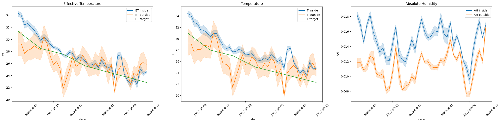

# MODELLING TEMPERATURE SENSATION IN A POULTRY BARN

## Chickens and their thermal environment
Meat chickens, also called broilers, in intensive rearing live in closed, controlled environment for about 36-42 days (depending on the target market) before they are brought to the abattoir. During this time, the thermal environment is very important, as chickens have no sweat glands and are prone to suffer from both cold and hot temperatures. Chickens manage their core temperature through heat exchange via their feet and their respiration, but are able to do so only after about 10 days of life. The so-called *thermo-neutral* zone of a chicken, i.e. the thermal range that allows a chicken to maintain a constant core temperature grows over time - the exact ranges are not currently known.

## Temperature isn't everything
Chickens like humans are affected not only by temperature: humidity also plays a great role. The higher the humidity, the more extreme temperature is perceived, because the higher water contents in the air conducts the heat better. Air flow or air speed also pays an important role: the higher the air speed, the colder it feels. This is called the *windchill effect*. For chickens, our best measure currently is called the *effective temperature* and is a combination of temperature, relative humidity and airspeed.

In order to cater for the different needs of birds during their lifetime, farmers have targets for temperature, relative humidity and some also for airspeed.

## How is the climate controlled
Modern barns operate heating and cooling elements automatically via sensor input. The so-called "controller", essentially a computer, uses inputs from sensors and translates them into actions: starting/stopping the heater, ventilators, air flaps and cooling elements. In essence, the controller compares the sensor input to the targets and decides on the action to be taken based on that information. Given that farms are quite large spaces (2,500m$^2$ x 3m height = 7,500m$^3$ is not atypical), controllers try to anticipate changes in the ambient conditions to avoid reaching suboptimal conditions for the animals.

## The cost of climate control
In cold weather, farms try to ventilate less - because then they have to heat the entering cold air which increases the cost of production. In hot weather, farmers use laminar ventilation (called "tunnel ventilation") to employ the windchill effect in cooling down the birds. Farms in hot climate also operate heat exchangers or coolers to mitigate outside conditions.

## Are controllers perfect?
If controllers were perfect and barns were perfect, the ambient conditions inside would be indentical with the targets. However, that is not true. The sun, for example, has significant impact by heating up the barn; this triggers higher ventilation rates and lower temperatures (or effective temperatures) in the afternoons. At the same time, while heating does change the relative humidity (it dries the air), heating is expensive. If the outside relative humidity is too high, but the temperature is acceptable, controllers will allow for a higher relative humidity. As controller typically do not operate on effective temperature, this means that the thermal sensation will be stronger (colder or hotter).

# The goal - how much impact do external conditions have on the thermal sensation of the animals?
The goal of this notebook is to **investigate the impact of outside conditions on the effective temperature inside the barn**. For this purpose, a data set is being made available from a particular in southern Europe for one production cycle of 40 days. The data was created from an IoT device and preprocessed so that there is a data point roughly every 8s. The task is to **use correlation analysis and linear regression** to identify whether outside weather conditions have an impact on the thermal sensation inside the barn and attempt to quantify this influence.